# UC-02: Join a Session

## Functional Use-Case Specification

### Use Case ID

UC-02

### Use Case Name

Join a Session

### Description

As a participant, I want to join a session with my selected identity and media state so that I can participate.

### Actor(s)

Participant; Session Service.

### Priority

P0.

### Trigger

The participant chooses Join from the preview interface.

### Pre-Condition(s)

PRE-1: The client displays a completed preview interface.

### Post-Condition(s)

POST-1: The client displays the joined session or a returned recovery state.
POST-2: The participant tile reflects the returned identity and media state.

### Basic Flow

1. The participant enters a display name and chooses Join.
2. The client submits the join request.
3. The system returns the joined participant and session summary.
4. The client renders the active session and participant tile.

### Alternative Flow

AF-1:

1. The participant changes a preview control before choosing Join.
2. The client submits the updated selections with the join request.

### Exception Flow

EF-1:

1. The system returns that the session cannot be joined.
2. The client displays the returned recovery state while preserving the preview context.

### Related UI

- Broadcaster Preview `6007:51245`.
- Video Conferencing Desktop Preview `6066:89727`.
- Live Streaming Mobile Preview `6012:44409`.
- Video Conferencing Mobile Preview `6066:89005`.

### Related API IDs

`API-SESSION-JOIN`.
`API-SESSION-STATE`.

### Notes

The shared model defines trusted context, persistence mapping, and query helpers. Server mutation execution uses MutationGateway and its common OCL constraints in UC-02. API command dispatch selects the named operation; it does not combine the preconditions of different operations. Read operations have no domain writes.

## UML Model

Classifiers and helper semantics are imported from the [shared domain model](shared-domain-model.md).

### Frozen Shared Domain Model

# Shared Domain Model

This file is the canonical package vocabulary. UC diagrams declare the operations relevant to that use case and import the classifiers below by name; they do not redefine entity shapes. UML nullable properties correspond to API nullability and DBML nullable columns. Optional non-patch request values decode to null when omitted; patch values additionally carry an explicit has-field flag. Collection elements are never null. Device IDs passed by join are copied from the client-validated draft. Command optional values may be null; PreferencePatch presence flags distinguish omission from explicit null.

RequestContext is request-local trusted adapter data, never a process-global mutable singleton. Its principal and session are decoded from the authenticated session access token; participantId is resolved from that principal's membership. Command actor/principal fields are server-populated, not additional public request fields. Guest and registered credentials use the same boundary. Provider callbacks use a separate authenticated adapter.

TransactionContext describes a database transaction. MutationGateway wraps every public server mutation. The gateway adapter dispatches exactly one selected operation on the fresh path; UC-12 through UC-14 and the personal-pin branch of UC-15 share one preference operation, while the shared spotlight branch uses SpotlightService. Domain operations below describe fresh successful dispatches; replay and rejection are handled by the gateway rules in UC-02. The persisted responseReference addresses an immutable serialized public response, including its HTTP status and envelope, not a resource that changes later. payloadHash is SHA-256 of canonical decoded method, path, and body, including field presence; tokens are excluded. Expired journal entries are replaced in the same transaction before a fresh receipt is written. Infrastructure errors roll back without a completion record. Policy constraints are in UC-02, not in this vocabulary definition.

DateTime::now returns the transaction clock; addHours adds elapsed hours and isAfter compares instants. DomainState::snapshot is the canonical serialization of the session and all session-owned domain rows, excluding the command journal and immutable response storage. DeviceCatalog is the client device-discovery adapter. PreviewDraft is local memory and has no participant foreign key. Server preference storage treats device identifiers as references; the client checks/applies availability before submitting and reports device failure through the UC exception flow.

Paging is a deterministic query helper. latestRecording returns the record with the latest (createdAt, id) key, including terminal records, or null when none exists. Participant cursors encode the session, collection and last immutable (joinedAt, id) key, sorted ascending; no host-first sorting is promised. Message cursors encode session, collection and last sequence, sorted ascending. An absent cursor starts before the first row. Participant nextCursor is null when the current scan is exhausted. Message and reaction cursors retain a high-water mark even on an empty page so polling can discover later rows. Reaction reads return the next event page in ascending sequence. Cursors are authenticated opaque values; validCursor checks decoding, signature, collection, and session. A later join may appear during participant pagination; the contract is a live keyset scan, not a frozen roster snapshot. These helper definitions supply query mechanics; domain access and limits remain in UC rules.

IDs use canonical UUID text at the wire and UUID columns in persistence. Sequences are positive session revision numbers reserved by the mutation transaction; all client mutations and provider completions advance session.version. Entity versions advance only when that entity changes. Raw media, screen tracks and PDF bytes are delivered through the external media/content adapter; sourceReference identifies that adapter's selected source. Session provisioning and token issuance are external boundaries. They supply a designated host principal, a LOBBY session, and a READY live-stream row for live-stream sessions before join.

```plantuml
@startuml
hide empty members
enum SessionKind {
  LIVE_STREAM
  VIDEO_CONFERENCE
}
enum SessionStatus {
  LOBBY
  LIVE
  ENDED
}
enum ParticipantRole {
  HOST
  BROADCASTER
  VIEWER
  STAGE_PARTICIPANT
}
enum ParticipantStatus {
  JOINED
  LEFT
}
enum StreamStatus {
  READY
  STARTING
  LIVE
  ENDED
}
enum StreamAction {
  START
  STOP
}
enum StageRequestStatus {
  PENDING
  ACCEPTED
  REJECTED
  CANCELLED
}
enum StageRequestAction {
  CREATE
  ACCEPT
  REJECT
  CANCEL
}
enum ShareKind {
  SCREEN
  PDF
}
enum ShareStatus {
  ACTIVE
  STOPPED
}
enum ShareAction {
  START
  STOP
}
enum RecordingStatus {
  IDLE
  STARTING
  RECORDING
  STOPPED
  FAILED
}
enum RecordingAction {
  START
  STOP
}
enum LayoutMode {
  EQUAL_PROMINENCE
  SIDEBAR
  PRESENTER
}
enum DepartureKind {
  LEAVE
  END
}
enum PermissionStatus {
  UNKNOWN
  GRANTED
  DENIED
}
enum ReactionCode {
  LIKE
  CLAP
  HEART
  CELEBRATE
  HAND
  SURPRISE
}
enum MutationOutcome {
  COMPLETED
  REJECTED
}
enum IsolationLevel {
  SERIALIZABLE
}
class String {
  trim(): String
}
class DateTime {
  {static} isAfter(value: DateTime, other: DateTime): Boolean
  {static} now(): DateTime
  {static} addHours(value: DateTime, hours: Integer): DateTime
}
class RequestContext {
  {static} principalId: String
  {static} participantId: String
  {static} sessionId: String
  {static} authenticated: Boolean
  {static} providerAuthenticated: Boolean
}
class TransactionContext {
  {static} lockedSessionId: String
  {static} isolation: IsolationLevel
  {static} atomicCommit: Boolean
}
class DomainState {
  {static} snapshot(sessionId: String): String
}
class Principal {
  id: String
  userId: String
}
class User {
  id: String
  displayName: String
}
class Session {
  id: String
  kind: SessionKind
  status: SessionStatus
  designatedHostPrincipalId: String
  hostParticipantId: String
  spotlightedParticipantId: String
  version: Integer
  endedAt: DateTime
  participants: Set(Participant)
}
class Participant {
  id: String
  sessionId: String
  principalId: String
  userId: String
  displayName: String
  role: ParticipantRole
  status: ParticipantStatus
  joinedAt: DateTime
  leftAt: DateTime
  microphoneEnabled: Boolean
  cameraEnabled: Boolean
  version: Integer
}
class LiveStream {
  id: String
  sessionId: String
  status: StreamStatus
  version: Integer
  startedAt: DateTime
  endedAt: DateTime
}
class StageRequest {
  id: String
  sessionId: String
  participantId: String
  status: StageRequestStatus
  decidedByParticipantId: String
  createdAt: DateTime
  decidedAt: DateTime
  version: Integer
}
class ChatMessage {
  id: String
  sessionId: String
  senderParticipantId: String
  body: String
  sentAt: DateTime
  sequence: Integer
}
class ReactionEvent {
  id: String
  sessionId: String
  participantId: String
  reaction: ReactionCode
  createdAt: DateTime
  sequence: Integer
}
class ContentShare {
  id: String
  sessionId: String
  ownerParticipantId: String
  kind: ShareKind
  status: ShareStatus
  sourceReference: String
  version: Integer
  startedAt: DateTime
  stoppedAt: DateTime
}
class Recording {
  createdAt: DateTime
  id: String
  sessionId: String
  startedByParticipantId: String
  status: RecordingStatus
  version: Integer
  startedAt: DateTime
  stoppedAt: DateTime
  providerReference: String
}
class Departure {
  id: String
  sessionId: String
  participantId: String
  kind: DepartureKind
  createdAt: DateTime
}
class MediaPreference {
  participantId: String
  microphoneDeviceId: String
  cameraDeviceId: String
  speakerDeviceId: String
  virtualBackgroundId: String
  updatedAt: DateTime
}
class ViewPreference {
  participantId: String
  layout: LayoutMode
  focusedParticipantId: String
  sidePanel: String
  pictureInPicture: Boolean
  updatedAt: DateTime
}
class VirtualBackground {
  id: String
  name: String
  assetReference: String
  active: Boolean
}
class DeviceCatalog {
  {static} isAvailable(participantId: String, deviceId: String): Boolean
}
class PreviewCommand {
  participantKey: String
  role: ParticipantRole
  displayName: String
  requestCamera: Boolean
  requestMicrophone: Boolean
}
class PreviewState {
  participantKey: String
  cameraPermission: PermissionStatus
  microphonePermission: PermissionStatus
  cameraAvailable: Boolean
  microphoneAvailable: Boolean
  cameraEnabled: Boolean
  microphoneEnabled: Boolean
  isReadyToJoin: Boolean
}
class PreviewDraft {
  participantKey: String
  microphoneDeviceId: String
  cameraDeviceId: String
  speakerDeviceId: String
  virtualBackgroundId: String
}
class JoinCommand {
  sessionId: String
  principalId: String
  userId: String
  displayName: String
  microphoneEnabled: Boolean
  cameraEnabled: Boolean
  microphoneDeviceId: String
  cameraDeviceId: String
  speakerDeviceId: String
  virtualBackgroundId: String
  idempotencyKey: String
}
class StreamControlCommand {
  sessionId: String
  actorParticipantId: String
  action: StreamAction
  expectedVersion: Integer
  idempotencyKey: String
}
class StageCommand {
  sessionId: String
  actorParticipantId: String
  requestId: String
  action: StageRequestAction
  expectedVersion: Integer
  idempotencyKey: String
}
class ChatCommand {
  sessionId: String
  senderParticipantId: String
  body: String
  idempotencyKey: String
}
class ReactionCommand {
  sessionId: String
  participantId: String
  reaction: ReactionCode
  idempotencyKey: String
}
class ContentShareCommand {
  sessionId: String
  ownerParticipantId: String
  action: ShareAction
  kind: ShareKind
  sourceReference: String
  expectedVersion: Integer
  idempotencyKey: String
}
class RecordingCommand {
  sessionId: String
  actorParticipantId: String
  action: RecordingAction
  expectedVersion: Integer
  idempotencyKey: String
}
class DepartureCommand {
  sessionId: String
  actorParticipantId: String
  kind: DepartureKind
  expectedVersion: Integer
  idempotencyKey: String
}
class PreferencePatch {
  sessionId: String
  participantId: String
  idempotencyKey: String
  hasMicrophoneDeviceId: Boolean
  microphoneDeviceId: String
  hasCameraDeviceId: Boolean
  cameraDeviceId: String
  hasSpeakerDeviceId: Boolean
  speakerDeviceId: String
  hasVirtualBackgroundId: Boolean
  virtualBackgroundId: String
  hasLayout: Boolean
  layout: LayoutMode
  hasFocusedParticipantId: Boolean
  focusedParticipantId: String
  hasSidePanel: Boolean
  sidePanel: String
  hasPictureInPicture: Boolean
  pictureInPicture: Boolean
}
class SpotlightCommand {
  sessionId: String
  actorParticipantId: String
  targetParticipantId: String
  expectedVersion: Integer
  idempotencyKey: String
}
class PreferencesResult {
  media: MediaPreference
  view: ViewPreference
}
class ParticipantListQuery {
  sessionId: String
  requesterParticipantId: String
  pageSize: Integer
  cursor: String
}
class ParticipantPage {
  items: Sequence(Participant)
  nextCursor: String
}
class MessageQuery {
  sessionId: String
  requesterParticipantId: String
  pageSize: Integer
  cursor: String
}
class MessagePage {
  items: Sequence(ChatMessage)
  nextCursor: String
}
class SessionState {
  session: Session
  selfParticipant: Participant
  stream: LiveStream
  recording: Recording
  share: ContentShare
  media: MediaPreference
  view: ViewPreference
  stageRequests: Set(StageRequest)
  reactions: Sequence(ReactionEvent)
  nextReactionCursor: String
}
class ViewerSession {
  sessionId: String
  participantId: String
  role: ParticipantRole
  streamStatus: StreamStatus
  streamVersion: Integer
  sessionVersion: Integer
  canPlayMedia: Boolean
  canPublishMedia: Boolean
  initialAudioMuted: Boolean
}
class MutationEnvelope {
  sessionId: String
  principalId: String
  operation: String
  idempotencyKey: String
  payloadHash: String
}
class MutationReceipt {
  principalId: String
  sessionId: String
  operation: String
  idempotencyKey: String
  payloadHash: String
  responseReference: String
  outcome: MutationOutcome
  completedAt: DateTime
  expiresAt: DateTime
  dispatchCount: Integer
}
class IdempotencyRecord {
  id: String
  principalId: String
  sessionId: String
  operation: String
  idempotencyKey: String
  payloadHash: String
  responseReference: String
  completedAt: DateTime
  expiresAt: DateTime
}
class ProviderCompletion {
  sessionId: String
  resourceId: String
  expectedVersion: Integer
  succeeded: Boolean
}
class Paging {
  {static} latestRecording(sessionId: String): Recording
  {static} participants(sessionId: String, pageSize: Integer, cursor: String): ParticipantPage
  {static} messages(sessionId: String, pageSize: Integer, cursor: String): MessagePage
  {static} reactions(sessionId: String, cursor: String): Sequence(ReactionEvent)
  {static} nextReactionCursor(sessionId: String, cursor: String): String
  {static} validCursor(sessionId: String, cursor: String, collection: String): Boolean
}
class PreviewService {
  prepare(command: PreviewCommand): PreviewState
}
class SessionJoinService {
  join(command: JoinCommand, session: Session): Participant
}
class MutationGateway {
  execute(command: MutationEnvelope, session: Session): MutationReceipt
}
class LiveStreamService {
  start(command: StreamControlCommand, stream: LiveStream, session: Session): LiveStream
  complete(command: ProviderCompletion, stream: LiveStream, session: Session): LiveStream
  stop(command: StreamControlCommand, stream: LiveStream, session: Session): LiveStream
  view(sessionId: String, participantId: String, session: Session, stream: LiveStream): ViewerSession
}
class StageService {
  submitRequest(command: StageCommand, session: Session, stream: LiveStream): StageRequest
  decide(command: StageCommand, session: Session, stream: LiveStream, request: StageRequest): StageRequest
}
class CollaborationService {
  listParticipants(query: ParticipantListQuery, session: Session): ParticipantPage
  sendMessage(command: ChatCommand, session: Session): ChatMessage
  listMessages(query: MessageQuery, session: Session): MessagePage
  sendReaction(command: ReactionCommand, session: Session): ReactionEvent
}
class SessionService {
  readState(session: Session, participant: Participant, reactionCursor: String): SessionState
  leave(command: DepartureCommand, session: Session): Departure
  end(command: DepartureCommand, session: Session): Departure
}
class ContentShareService {
  control(command: ContentShareCommand, session: Session): ContentShare
}
class PreferenceService {
  update(command: PreferencePatch, media: MediaPreference, view: ViewPreference): PreferencesResult
  listBackgrounds(): Set(VirtualBackground)
}
class SpotlightService {
  update(command: SpotlightCommand, session: Session): Session
}
class ClientPreferenceService {
  selectDevices(draft: PreviewDraft, microphone: String, camera: String, speaker: String): PreviewDraft
  selectBackground(draft: PreviewDraft, backgroundId: String): PreviewDraft
}
class RecordingService {
  control(command: RecordingCommand, session: Session): Recording
  complete(command: ProviderCompletion, recording: Recording, session: Session): Recording
}
Session "1" -- "0..*" Participant
Session "1" -- "0..1" LiveStream
Participant "1" -- "1" MediaPreference
Participant "1" -- "1" ViewPreference
Principal "1" -- "0..*" Participant
@enduml
```

### Use-Case Operations

~~~plantuml
@startuml
class SessionJoinService {
  join(command: JoinCommand, session: Session): Participant
}
class MutationGateway {
  execute(command: MutationEnvelope, session: Session): MutationReceipt
}
@enduml
~~~

## Business Rules

~~~ocl
-- BR-UC-02-01
-- Source: Assumption
-- Assumption: A-19
context SessionJoinService::join(command: JoinCommand, session: Session): Participant
pre BR_UC_02_01_TrustedJoinPrincipal:
  RequestContext::authenticated and command.sessionId = RequestContext::sessionId and
  command.principalId = RequestContext::principalId and
  Principal.allInstances()->exists(p | p.id = command.principalId and p.userId = command.userId)
~~~

~~~ocl
-- BR-UC-02-02
-- Source: Assumption
-- Assumption: A-19
context SessionJoinService::join(command: JoinCommand, session: Session): Participant
pre BR_UC_02_02_TargetSession:
  command.sessionId = session.id and session.status <> SessionStatus::ENDED
~~~

~~~ocl
-- BR-UC-02-03
-- Source: Assumption
-- Assumption: A-20
context SessionJoinService::join(command: JoinCommand, session: Session): Participant
pre BR_UC_02_03_CommandKey:
  command.idempotencyKey <> null and command.idempotencyKey.trim().size() > 0
~~~

~~~ocl
-- BR-UC-02-04
-- Source: Assumption
-- Assumption: A-01
context SessionJoinService::join(command: JoinCommand, session: Session): Participant
pre BR_UC_02_04_Name:
  command.displayName <> null and command.displayName.trim().size() > 0 and command.displayName.trim().size() <= 50
~~~

~~~ocl
-- BR-UC-02-05
-- Source: Assumption
-- Assumption: A-02
context SessionJoinService::join(command: JoinCommand, session: Session): Participant
pre BR_UC_02_05_NoDuplicateMembership:
  not session.participants->exists(p | p.principalId = command.principalId and p.status = ParticipantStatus::JOINED)
~~~

~~~ocl
-- BR-UC-02-06
-- Source: Assumption
-- Assumption: A-02
context SessionJoinService::join(command: JoinCommand, session: Session): Participant
pre BR_UC_02_06_Capacity:
  let count : Integer = session.participants->select(p | p.status = ParticipantStatus::JOINED)->size() in
  (session.kind = SessionKind::VIDEO_CONFERENCE implies count < 100) and
  (session.kind = SessionKind::LIVE_STREAM implies count < 1000)
~~~

~~~ocl
-- BR-UC-02-07
-- Source: Assumption
-- Assumption: A-02
context SessionJoinService::join(command: JoinCommand, session: Session): Participant
post BR_UC_02_07_CreatedIdentity:
  result.oclIsNew() and result.id <> null and result.sessionId = command.sessionId and result.principalId = command.principalId and result.userId = command.userId
~~~

~~~ocl
-- BR-UC-02-08
-- Source: Assumption
-- Assumption: A-02
context SessionJoinService::join(command: JoinCommand, session: Session): Participant
post BR_UC_02_08_JoinedParticipant:
  result.status = ParticipantStatus::JOINED and result.displayName = command.displayName.trim() and
  result.joinedAt <> null and result.leftAt = null and result.version = 1 and
  session.participants = session.participants@pre->including(result)
~~~

~~~ocl
-- BR-UC-02-09
-- Source: Assumption
-- Assumption: A-02
context SessionJoinService::join(command: JoinCommand, session: Session): Participant
post BR_UC_02_09_ExclusiveRole:
  result.role = if command.principalId = session.designatedHostPrincipalId
    then ParticipantRole::HOST
    else if session.kind = SessionKind::LIVE_STREAM then ParticipantRole::VIEWER
      else ParticipantRole::BROADCASTER endif endif
~~~

~~~ocl
-- BR-UC-02-10
-- Source: Assumption
-- Assumption: A-02
context SessionJoinService::join(command: JoinCommand, session: Session): Participant
post BR_UC_02_10_EffectiveMedia:
  result.microphoneEnabled = (result.role <> ParticipantRole::VIEWER and command.microphoneEnabled) and
  result.cameraEnabled = (result.role <> ParticipantRole::VIEWER and command.cameraEnabled)
~~~

~~~ocl
-- BR-UC-02-11
-- Source: Assumption
-- Assumption: A-02
context SessionJoinService::join(command: JoinCommand, session: Session): Participant
post BR_UC_02_11_HostOpensSession:
  if result.role = ParticipantRole::HOST then
    session.hostParticipantId = result.id and session.status = SessionStatus::LIVE
  else session.hostParticipantId = session.hostParticipantId@pre and session.status = session.status@pre endif
~~~

~~~ocl
-- BR-UC-02-12
-- Source: Assumption
-- Assumption: A-13
context SessionJoinService::join(command: JoinCommand, session: Session): Participant
pre BR_UC_02_12_DraftBackground:
  command.virtualBackgroundId = null or VirtualBackground.allInstances()->exists(b | b.id = command.virtualBackgroundId and b.active)
~~~

~~~ocl
-- BR-UC-02-13
-- Source: Assumption
-- Assumption: A-12
context SessionJoinService::join(command: JoinCommand, session: Session): Participant
post BR_UC_02_13_InitializePreferences:
  MediaPreference.allInstances()->one(m | m.participantId = result.id and m.oclIsNew() and
    m.microphoneDeviceId = command.microphoneDeviceId and m.cameraDeviceId = command.cameraDeviceId and
    m.speakerDeviceId = command.speakerDeviceId and m.virtualBackgroundId = command.virtualBackgroundId and m.updatedAt <> null) and
  ViewPreference.allInstances()->one(v | v.participantId = result.id and v.oclIsNew() and
    v.layout = LayoutMode::EQUAL_PROMINENCE and v.focusedParticipantId = null and v.sidePanel = null and
    not v.pictureInPicture and v.updatedAt <> null)
~~~

~~~ocl
-- BR-UC-02-14
-- Source: Assumption
-- Assumption: A-20
context MutationGateway::execute(command: MutationEnvelope, session: Session): MutationReceipt
pre BR_UC_02_14_GatewayIdentityAndTransaction:
  RequestContext::authenticated and command.principalId = RequestContext::principalId and
  command.sessionId = RequestContext::sessionId and command.sessionId = session.id and
  TransactionContext::lockedSessionId = session.id and TransactionContext::isolation = IsolationLevel::SERIALIZABLE and
  TransactionContext::atomicCommit and command.idempotencyKey <> null and command.idempotencyKey.trim().size() > 0
~~~

~~~ocl
-- BR-UC-02-15
-- Source: Assumption
-- Assumption: A-20
context MutationGateway::execute(command: MutationEnvelope, session: Session): MutationReceipt
post BR_UC_02_15_ReplayOrDispatch:
  let previous : Set(IdempotencyRecord) = IdempotencyRecord.allInstances()@pre->select(r |
    r.principalId = command.principalId and r.sessionId = command.sessionId and r.operation = command.operation and
    r.idempotencyKey = command.idempotencyKey and DateTime::isAfter(r.expiresAt, DateTime::now())) in
  if previous->notEmpty() then
    result.dispatchCount = 0 and session.version = session.version@pre and
    if previous->any(true).payloadHash = command.payloadHash then
      result.outcome = MutationOutcome::COMPLETED and result.responseReference = previous->any(true).responseReference
    else result.outcome = MutationOutcome::REJECTED endif
  else
    result.dispatchCount = 1 and
    if result.outcome = MutationOutcome::COMPLETED then session.version = session.version@pre + 1
    else session.version = session.version@pre endif
  endif
~~~

~~~ocl
-- BR-UC-02-16
-- Source: Assumption
-- Assumption: A-20
context MutationGateway::execute(command: MutationEnvelope, session: Session): MutationReceipt
post BR_UC_02_16_PersistReceipt:
  (result.dispatchCount = 1 and result.outcome = MutationOutcome::COMPLETED) implies
  IdempotencyRecord.allInstances()->one(r | r.principalId = command.principalId and r.sessionId = command.sessionId and
    r.operation = command.operation and r.idempotencyKey = command.idempotencyKey and
    r.payloadHash = command.payloadHash and r.responseReference = result.responseReference and
    r.completedAt = result.completedAt and r.expiresAt = DateTime::addHours(r.completedAt, 24))
~~~

~~~ocl
-- BR-UC-02-17
-- Source: Assumption
-- Assumption: A-20
context MutationGateway::execute(command: MutationEnvelope, session: Session): MutationReceipt
post BR_UC_02_17_NoEffectsOnReplayOrRejection:
  (result.dispatchCount = 0 or result.outcome = MutationOutcome::REJECTED) implies
  DomainState::snapshot(session.id) = DomainState::snapshot@pre(session.id)
~~~

~~~ocl
-- BR-UC-02-18
-- Source: Assumption
-- Assumption: A-22
context Session
inv BR_UC_02_18_SessionParticipantBindings:
  self.participants = Participant.allInstances()->select(p | p.sessionId = self.id) and
  self.participants->select(p | p.status = ParticipantStatus::JOINED)->isUnique(principalId) and
  self.participants->select(p | p.status = ParticipantStatus::JOINED and p.role = ParticipantRole::HOST)->size() <= 1
~~~

~~~ocl
-- BR-UC-02-19
-- Source: Assumption
-- Assumption: A-22
context Session
inv BR_UC_02_19_SessionCapacityInvariant:
  let joined : Set(Participant) = self.participants->select(p | p.status = ParticipantStatus::JOINED) in
  (self.kind = SessionKind::VIDEO_CONFERENCE implies joined->size() <= 100) and
  (self.kind = SessionKind::LIVE_STREAM implies joined->size() <= 1000 and
    joined->select(p | p.role <> ParticipantRole::VIEWER)->size() <= 10)
~~~
